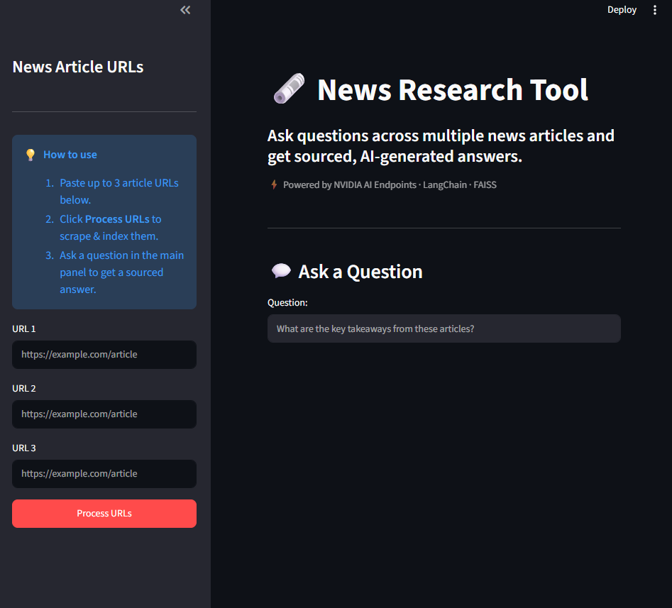

# 🗞️ InsightRAG

🚀 **[Live Demo Available Here](https://insight-rag-c6tw84fxcj5bcvg77frjiu.streamlit.app)**

**InsightRAG** is a premium AI system for effortless information retrieval across news articles. Paste in article URLs, ask questions in natural language, and receive concise, sourced answers — powered by **NVIDIA AI Endpoints**.

Built for speed and clarity, the tool combines state-of-the-art large language models with fast semantic search to turn scattered news content into instant, cited insights.

---

## ✨ Features

- Load one or more article URLs to fetch and process content.
- Extract clean article text robustly with `requests` + `trafilatura` (browser User-Agent to bypass basic bot-blocking, with graceful per-URL failure reporting).
- Construct embedding vectors using **NVIDIA Embeddings (`NV-Embed-QA`)** and leverage **FAISS**, a powerful similarity search library, for swift and effective retrieval of relevant information.
- Interact with the **NVIDIA-hosted `meta/llama-3.3-70b-instruct` LLM** by inputting queries and receiving answers along with source URLs.
- Enjoy a modern dashboard with animated progress indicators, processing metrics, and clean card-style answer presentation.

---

## 🎨 User Interface

A clean, premium Streamlit dashboard with animated status steps, live processing metrics, and card-style answers:



<!-- Drop your application screenshot at docs/app_screenshot.png (or update the path above). -->

---

## 🛠️ Tech Stack

- **LLM:** NVIDIA AI Endpoints — `meta/llama-3.3-70b-instruct` (via `ChatNVIDIA`)
- **Embeddings:** NVIDIA — `NV-Embed-QA` (via `NVIDIAEmbeddings`)
- **Framework:** LangChain
- **Vector Store:** FAISS
- **UI:** Streamlit

---

## 🚀 Installation

1. Clone this repository to your local machine:

```bash
git clone https://github.com/mithun2244/news-research-tool.git
```

2. Navigate to the project directory:

```bash
cd news-research-tool
```

3. Install the required dependencies using pip:

```bash
pip install -r requirements.txt
```

4. Set up your **NVIDIA API key** by creating a `.env` file in the project root and adding your key:

```bash
NVIDIA_API_KEY=your_api_key_here
```

> 🔑 You can generate an API key from the [NVIDIA API Catalog](https://build.nvidia.com/). Keep your `.env` file private — it is excluded from version control via `.gitignore`.

---

## 💻 Usage/Examples

1. Run the Streamlit app by executing:

```bash
streamlit run main.py
```

2. The web app will open in your browser.

- On the sidebar, input up to 3 article URLs directly.
- Initiate data loading and processing by clicking **"Process URLs"**.
- Watch the animated status container as the system scrapes articles, generates NVIDIA embeddings, and builds the vector database.
- Once complete, success metrics display the number of URLs loaded, text chunks created, and processing time.
- The FAISS index is saved to a local pickle file for future use.
- Ask a question and get an answer — presented in a clean card layout — based on those news articles, complete with sources.

Example news articles to try:

- https://www.moneycontrol.com/news/business/tata-motors-mahindra-gain-certificates-for-production-linked-payouts-11281691.html
- https://www.moneycontrol.com/news/business/tata-motors-launches-punch-icng-price-starts-at-rs-7-1-lakh-11098751.html
- https://www.moneycontrol.com/news/business/stocks/buy-tata-motors-target-of-rs-743-kr-choksey-11080811.html

---

## 📂 Project Structure

- `main.py` — The main Streamlit application script.
- `requirements.txt` — A list of required Python packages for the project.
- `faiss_store.pkl` — A pickle file to store the FAISS index.
- `.env` — Configuration file for storing your **NVIDIA API key** (not committed to version control).

---

## 👤 Author

System architecture designed and built by **Mithun Roy**, AI and Machine Learning Engineer.
